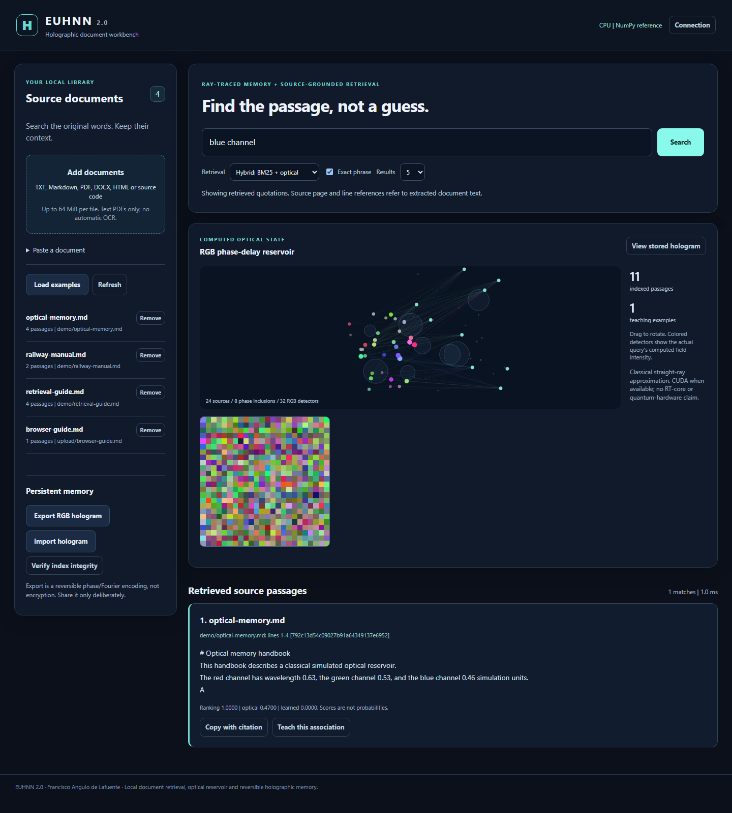

# EUHNN 2.0 - Holographic document workbench

**Ray-traced RGB optical memory, trainable associations, and exact source retrieval.**

By **Francisco Angulo de Lafuente**. This is the new, runnable version of the
Enhanced Unified Holographic Neural Network research line. The 2024 source and
contest-history material are [preserved separately](docs/LEGACY.md), not overwritten.



## Start here

**Windows:** run `Start-EUHNN.cmd`. **Linux/macOS:** run `sh start-euhnn.sh`.
The launcher prepares an isolated environment and opens the local workbench.
It requires **Python 3.12+** and internet access for the first dependency installation.
Thereafter, document processing runs locally. **No API key or paid model is required.**

Choose **Load examples**, or **Add documents**, then search. Matches include the
original passage, source name, page when available, line range and character offsets.
A **Teach this association** button trains a persistent query-to-passage readout.
**Export RGB hologram** and **Import hologram** perform a checked, reversible memory round-trip.

The optional Windows portable package, when present under this repository's
[Releases](https://github.com/Agnuxo1/Unified-Holographic-Neural-Network/releases),
runs without an installed Python. It is explicitly the CPU edition; the source
launcher supports the separately validated NVIDIA CUDA backend.

For developers:

```bash
git clone https://github.com/Agnuxo1/Unified-Holographic-Neural-Network.git
cd Unified-Holographic-Neural-Network
python -m pip install ".[workbench]"
python -m euhnn --backend cpu --index demo.sqlite demo
python -m euhnn --index demo.sqlite serve --port 0 --open
```

The server binds to **127.0.0.1**, creates a fresh access token, and uses no external
JavaScript/CDN. Keep its terminal window open; Ctrl+C stops it. Reopen the launch
link after a page reload, because the browser does not persist the token.

## What is implemented

| Component | Implementation |
| --- | --- |
| Optical reservoir | Real segment-sphere intersections, wavelength-dependent phase delay, absorption, coherent RGB fields and nonlinear intensity features |
| CPU and NVIDIA GPU | NumPy reference and an actual CUDA intersection kernel plus CuPy propagation; CPU/CUDA interoperability is tested |
| Long-document retrieval | Persistent SQLite FTS5/BM25 with bounded optical reranking, original-text quotations and exact provenance |
| Learning | Supervised, regularized ridge readout from explicit query-to-passage examples; survives restart |
| Holographic memory | Compressed bytes encoded as RGB phase grids, complex Fourier spectra, inverse reconstruction and SHA-256 checks |
| Document readers | TXT, Markdown, text PDFs, DOCX, HTML and common source-code/text formats |
| Local application | Responsive workbench, authenticated API, file import, search, teaching, export/restore and integrity verification |
| Native integrations | LangChain, LangGraph, LlamaIndex, CrewAI, Haystack, Microsoft Agent Framework, smolagents, Agno, PydanticAI and AutoGen |

## Measured results and honest limits

The [reproducible benchmark](docs/BENCHMARKS.md) uses one **2,000-page synthetic
manual**, **424,000 words**, **4,000 passages** and **24 identifier-bearing questions**.
The corrected hybrid mode and the BM25 baseline both find all 24 answers at rank one
in this fixture. This is **not an independent semantic-search benchmark**.
All results, including the weaker experimental optical-only mode and the initial
failed hybrid result, remain available in `audit/`.

GPU acceleration of the ray calculation does **not** mean the whole document
search is faster. The report separately records ray-kernel and end-to-end timings.
Small searches can be faster on CPU because text handling, SQLite and transfers
remain part of the total workload.

Important boundaries:

- This is a **classical numerical optical model**, not quantum hardware, a Maxwell solver,
  a full refractive/path tracer, or a pretrained language model. It does **not** invoke OptiX or RT cores.
- Optical text signatures use deterministic lexical/subword features, not pretrained
  semantic embeddings. Hybrid retrieval is the default; optical-only full scan is experimental.
- A hologram export is **not encryption, authentication or a guaranteed compression gain**.
  Source text remains available in the local index and exported memory.
- PDFs need extractable text; no automatic OCR is performed. DOCX citations do not invent page numbers.
- The local application is single-user, not a public multi-tenant hosting service.
  The legacy P2P and external-provider experiments remain in the preserved 2024 code.

## Search and memory from Python

```python
from pathlib import Path
from euhnn import HolographicIndex

with HolographicIndex("library.sqlite", create=True, backend="cpu") as library:
    library.ingest_text(
        "The blue optical channel has wavelength 0.46 simulation units.",
        source="optical-manual.txt",
    )
    hits = library.search("blue wavelength", top_k=5)
    for hit in hits:
        print(hit.citation)
        print(hit.text)
    if hits:
        library.learn("short wavelength channel", hits[0].chunk_id)
    print(library.context("blue wavelength"))
    memory = library.export_hologram()
    Path("example-memory.holo").write_bytes(memory)
    assert library.verify()["ok"]
```

For a ready-to-run library/adapter walkthrough, see [examples](examples/README.md).
The CLI `export` command refuses to overwrite an existing file.

## NVIDIA CUDA

The source launcher detects a compatible NVIDIA driver and installs one matching
CuPy package. `--backend cuda` requests CUDA explicitly and reports a failure rather
than pretending to execute on GPU. `--backend cpu` selects the reference implementation.

```bash
python launch.py --backend cuda
python -m euhnn --backend cuda doctor
```

Manual installation uses **one**, not both, of `.[cuda12]` or `.[cuda13]` with an
appropriate CUDA toolkit. For driver-only environments, CuPy documents its `[ctk]`
component-wheel installation option. See [setup and troubleshooting](docs/SETUP.md).

## Native framework integrations

Adapters return actual native retrievers, pipeline components, graphs or tools.
They are tested by executing the framework APIs, not merely by importing modules.
Source passages are intentionally handed to the caller; the caller controls which
model may see them and must treat document instructions as untrusted data.

```bash
python -m pip install ".[llamaindex]"
```

```python
from euhnn.adapters import make_adapter

retriever = make_adapter("llamaindex", "library.sqlite", top_k=5)
for result in retriever.retrieve("blue wavelength"):
    print(result.node.metadata["citation"])
    print(result.node.text)
```

[Integration guide](docs/INTEGRATIONS.md) - [Native execution evidence](audit/native-integrations.json)

## Verification

```bash
python -m pip install ".[workbench,test,integrations,browser]"
python -m playwright install chromium
python scripts/run-tests.py tests -q
python scripts/benchmark.py --pages 2000
```

On a configured NVIDIA host, add `--cuda` to the benchmark. Set
`EUHNN_REQUIRE_CUDA=1` before the test command to make missing GPU execution a
failure instead of an explicit skip. Browser tests require the installed browser.
The test runner isolates application storage and removes inherited service credentials.

[Architecture](docs/ARCHITECTURE.md) - [Benchmark method and all results](docs/BENCHMARKS.md) -
[Security](SECURITY.md) - [Contributing](CONTRIBUTING.md) - [Changelog](CHANGELOG.md) -
[Legacy provenance](docs/LEGACY.md)

## License and historical credit

MIT; see [LICENSE](LICENSE). The original project author and 2024 contest-history
references are retained. The new v2 release is not represented as a new NVIDIA
award, NVIDIA certification or upstream adoption by any integrated framework.
